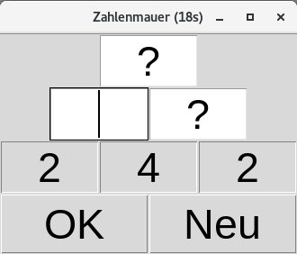
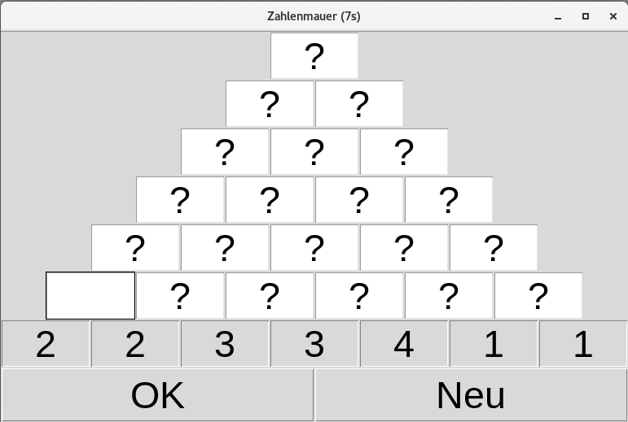
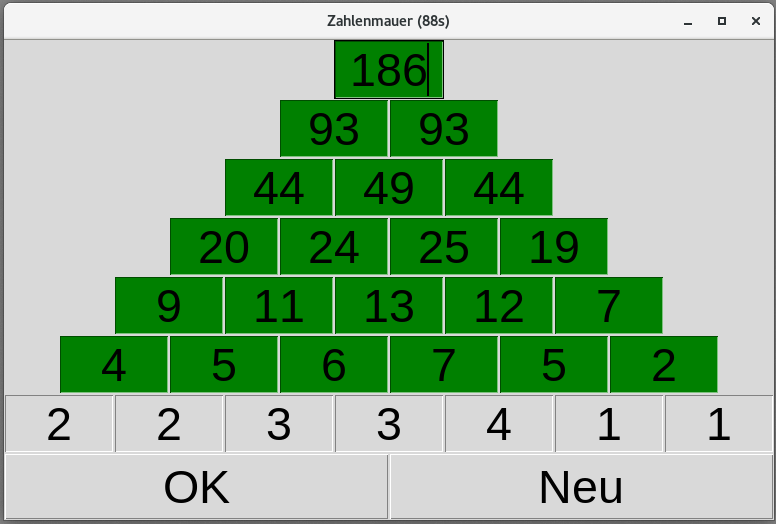
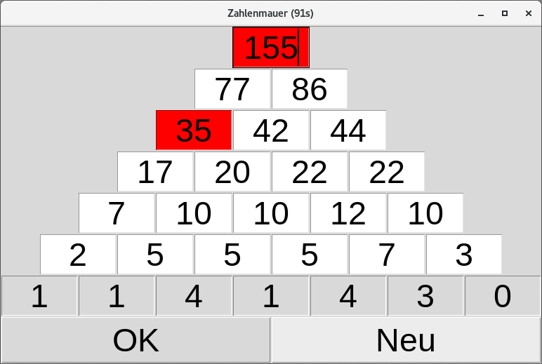

# Number Pyramid
a number pyramid math trainer for children writen in pure python

Usage:
Start the app from the commandline:
```
number pyramid math trainer
Usage: number_pyramid.py [rows number_range]

rows:           number of brick rows

number_range:   range of numbers for the bottom row [0 to number_range]

>> python3 number_pyramid.py 3 5
```

To navigate between the cells you can use either the arrow keys `[Left, Right, Up, Down]` or the tab key. pressing the return key on all cells or click `OK` will submit the input. If the result was correct all cells get green, otherwise the wrong cells are marked red. If you click `New` a new problem will be given. 









